# Shift plan generation

Documents how `generateShiftPlan.ts` turns survey responses into shift assignments. It runs
once per `ShiftPlanningPeriod` (blocked from re-running once `status === "generated"` — see
"Reset period" in the admin UI to undo a run and try again).

## Pipeline

Five phases, always in this order. Each phase's counters feed into the ones after it, which is
why the order matters — see "Why this order" below.

```mermaid
flowchart TD
    Start([Generate shift plan]) --> Guard{Period already<br/>generated?}
    Guard -- yes --> Reject[["failed-precondition:<br/>reset the period first"]]
    Guard -- no --> P1

    subgraph P1["Phase 1 — Non-mandatory anchors"]
        direction TB
        P1a["anchorOnly experienced anchors<br/>leveled-filled first<br/>(no tender fallback, so priority)"]
        P1b["mixed experienced anchors<br/>fill whatever anchor slots remain"]
        P1a --> P1b
    end

    P1 --> P2

    subgraph P2["Phase 2 — New anchors"]
        direction TB
        P2a["Each new anchor guaranteed<br/>1 opening + 1 closing anchor shift"]
        P2b["Restricted to shifts already anchored<br/>by an experienced anchor (Phase 1),<br/>and to shifts on/after the anchor<br/>seminar cutoff date"]
        P2a --> P2b
    end

    P2 --> P3

    subgraph P3["Phase 3 — Non-mandatory tenders"]
        direction TB
        P3a["Unified pool: all categories<br/>considered together, not opening→<br/>closing→middle in sequence"]
        P3b["Each round: only people at the<br/>CURRENT MINIMUM total-shift count<br/>are offered a slot"]
        P3c["Choice between opening/closing?<br/>Steer toward whichever category<br/>they currently have fewer of"]
        P3d["Capped: perUserTotalCap /<br/>perUserOpeningCap / perUserClosingCap<br/>(dynamic, see below)"]
        P3a --> P3b --> P3c --> P3d
    end

    P3 --> P4

    subgraph P4["Phase 4 — Mandatory anchors"]
        direction TB
        P4a["Same anchorOnly-first-then-mixed<br/>leveled fill as Phase 1"]
        P4b["Runs AFTER Phase 3 so it's informed<br/>by the full non-mandatory picture"]
        P4a --> P4b
    end

    P4 --> P5

    subgraph P5["Phase 5 — Mandatory tenders"]
        direction TB
        P5a["Everyone eligible + available<br/>GUARANTEED a shift — no cap applies"]
        P5b["Only real decision: WHICH of the<br/>event's own shifts they land on"]
        P5c["Steered by true-total opening/closing<br/>counters (incl. anchor + mandatory<br/>exposure), spread by current fill<br/>level so one shift isn't overloaded"]
        P5a --> P5b --> P5c
    end

    P5 --> Persist[Persist engagements,<br/>period stats, role updates,<br/>pre-generation snapshot]
    Persist --> Done([Return summary + warnings])

    classDef phase fill:#eef4ff,stroke:#4a6fa5,color:#1a2b4a;
    class P1,P2,P3,P4,P5 phase;
```



Every candidate slot in every phase is also checked against the **avoid-shift-with** list
(`avoidShiftWithUserIds` on the user doc) — two people who shouldn't work together are never
matched to the same shift, in either direction, in any phase.

## Why this order

- **Mandatory runs after non-mandatory** (Phase 4/5 after Phase 1/2/3): mandatory duty is
  guaranteed regardless of load, so it doesn't need — and mustn't be blocked by — the total-shift
  cap. Running it last means mandatory placement can be *informed* by everyone's real workload
  so far (steer people toward whichever category they're behind on), without that cap ever
  risking skipping someone who's supposed to be guaranteed a mandatory shift.
- **`anchorOnly` before mixed anchors** (Phase 1 and 4): an `anchorOnly` member has no tender
  fallback — their entire workload comes from anchor duty — so they get first access to the
  shared fair-share cap. A mixed anchor can always fall back to tender shifts if anchor slots
  run short for them; an `anchorOnly` member can't.
- **Anchors before tenders within each half** (1 before 3, 4 before 5): anchor commitments count
  toward the same shared total, so tender fill needs to see them first to correctly deprioritize
  people who already picked up anchor duty.

## Dynamic caps (no fixed numbers)

Caps scale to this period's own shift-to-member ratio instead of a hardcoded constant — the
same idea as the "shifts per member" stat already shown in the admin UI:

```
perUserTotalCap   = ceil(non-mandatory total capacity   / active members)
perUserOpeningCap = ceil(non-mandatory opening capacity  / active members)
perUserClosingCap = ceil(non-mandatory closing capacity  / active members)
```

Mandatory capacity is excluded from these sums on purpose — mandatory duty is a separate,
guaranteed layer on top, not something these caps are meant to bound.

**Mandatory is never capped, anywhere, including anchors.** `perUserTotalCap`/`perUserOpeningCap`/
`perUserClosingCap` gate Phase 1 (non-mandatory anchors) and Phase 3 (non-mandatory tenders) as
hard blocks. Phase 4 (mandatory anchors) and Phase 5 (mandatory tenders) never check any of them —
mandatory is treated as an add-on that fills in on top of whatever non-mandatory scheduling already
produced, guaranteed regardless of load. Both mandatory phases still *steer* toward whichever
category someone's currently lower on (true-total counters), they just never refuse a slot because
of it — a preference, not a limit.

## Two kinds of opening/closing counters

- **Capped counters** (`assignedOpeningCountByUser` / `assignedClosingCountByUser`) — exclude
  mandatory events. Used only to enforce the hard caps in Phases 1 and 3 (non-mandatory anchors
  and tenders).
- **True-total counters** (`totalOpeningCountByUser` / `totalClosingCountByUser`) — count
  everything: anchor or tender, mandatory or not. Used only to *steer* Phases 4 and 5's mandatory
  placement toward whichever category someone's behind on — never to cap them, since the mandatory
  guarantee always wins.

## Level-filling, in one sentence

Instead of matching as many people as possible in one shot (which has no fairness objective —
it just maximizes the number of filled slots), each fill loop repeats in rounds, and within a
round only offers slots to whoever currently has the fewest shifts among people who still have an
eligible slot at all. That's what stops one person ending up at 7 shifts while someone equally
available sits at 3 — nobody gets a *second* shift while someone eligible is still at zero.

## Requirements checklist

Verified against the actual code, not just the design intent. Status as of the last review:

| # | Requirement | Status | Notes |
|---|---|---|---|
| 1 | At most "total tenders including anchors" on each shift | ✅ non-mandatory / ⚪ N/A mandatory | Non-mandatory: `tenderSlots` are built as `configuredTenders - assignedAnchorsOnShift - assignedTendersOnShift`, so anchors+tenders together never exceed `shift.tenders`. **Deliberately not enforced for mandatory shifts** — mandatory means everyone eligible works regardless of capacity; Phase 5 only uses load as a sort *preference*, never a hard cap. |
| 2 | At most one shift per event per user (anchor + tender combined) | ✅ fixed | Phase 3/5's tender checks already enforced this via `assignedEventsByUser`. Phase 1/4's anchor check (`canTakeAnchorSlot`) did **not** until this review — found and fixed: without it, one experienced anchor could be matched to two different shifts of the same event (e.g. its opening and closing shift both needing an anchor). |
| 3 | `anchorOnly` users never get a tender shift | ✅ holds | Doubly enforced: `regularUsers` (used by Phases 3 and 5) excludes `anchorOnly` entirely, and `canTakeTenderSlot` also explicitly returns `false` for them. |
| 4 | Tenders only assigned shifts they can actually be part of | ✅ holds | Every phase's eligibility check ends with `effectiveAvailability(...)`, plus same-shift and avoid-conflict checks. |
| 5 | Users get approximately equal opening-shift counts | ✅ holds (capped non-mandatory, steered mandatory) | Non-mandatory (Phases 1 and 3): hard-capped at `perUserOpeningCap`, for both anchors (`canTakeAnchorSlot`) and tenders (`canTakeTenderSlot`) — closes the gap found in the previous review. Mandatory (Phases 4 and 5): never capped — mandatory is an add-on, guaranteed regardless of load — but still steered toward whichever category someone's currently lower on, using the true-total counters. |
| 6 | Users get approximately equal closing-shift counts | ✅ holds (capped non-mandatory, steered mandatory) | Same mechanism as #5, mirrored for `perUserClosingCap`. |
| 7 | Tenders capped at `ceil(shifts per member)` | ✅ holds | `perUserTotalCap` bounds each person's *total* (anchor+tender combined); tender-count is always ≤ total, so it's always within the cap. Denominator is `activeUsers.length` (all active members, matching the existing admin UI "shifts per member" stat) rather than tender-eligible members only — a deliberate choice for consistency, not a bug. |
| 8 | If a user can join any shift in a mandatory event, they get one that day | ✅ holds | Phase 5 always assigns when `candidateShifts` is non-empty — no cap check can block it, by design. |
| 9 | If a user can't join any shift in a mandatory event, they get nothing that day | ✅ holds | Phase 5 never assigns when `candidateShifts` is empty; only logs a warning if they had availability that went unmatched for another reason. |
| 10 | Users on each other's avoid-list never share a shift | ✅ holds | Checked via `hasAvoidConflictOnShift` in every phase — Phase 1/4 (`canTakeAnchorSlot` + level-fill filtering), Phase 2 (`hasConflict` passed to the matcher), Phase 3 (`canTakeTenderSlot` + level-fill filtering), Phase 5 (candidate-shift filter). |

**Open gap**: rows 5/6. If anchor-duty opening/closing balance matters as much as tender-duty
balance, Phase 1/4's slot choice would need the same category-steering treatment Phase 3/5
already have — currently out of scope, not yet implemented.
